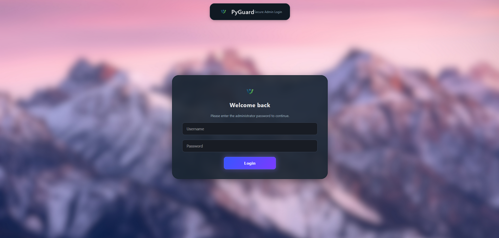
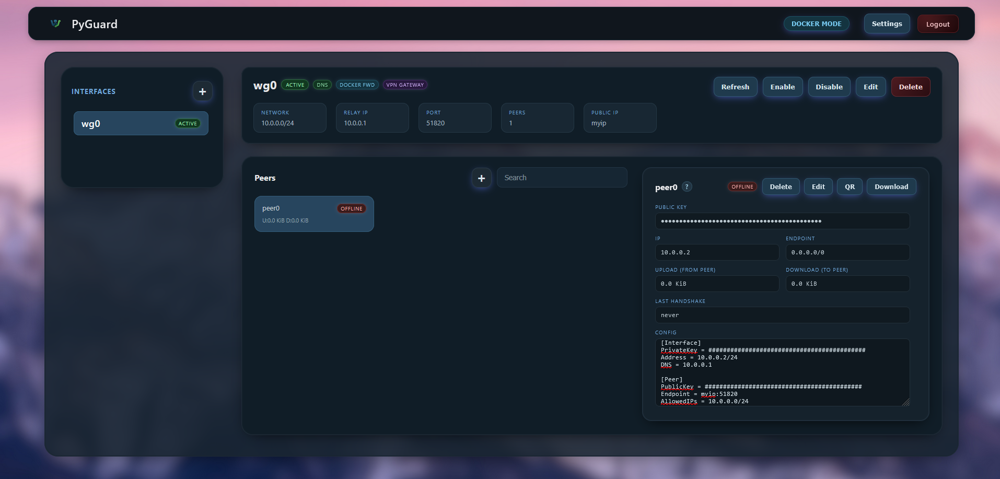

# PyGuard

Self‑hosted WireGuard management toolkit that bundles:

- A batteries‑included Python CLI (`pyguard.py`) for provisioning & managing WireGuard interfaces, peers, DNS, and systemd services
- A FastAPI powered HTTP+Web UI (`pyguard-api.py`) with login, JWT (httpOnly cookies), dashboard & REST endpoints
- An optional lightweight authoritative / forwarding DNS service (`pyguard-dns.py`) that can answer interface‑local hostnames and forward the rest (`WIP`)
- A Docker image (userspace `wireguard-go`) for portable deployments where kernel modules are unavailable

Status: early (alpha) - APIs & data layout may still change. Feedback / issues welcome.

---

## Highlights

- Pure Python management (no external DB) - state stored as JSON per interface in `/etc/pyguard/<iface>.conf`
- Automatic interface bootstrap (keys, config render, systemd service) and launch orchestration
- Peer lifecycle: add, list, revoke, regenerate configs + optional QR render (uses `qrencode`)
- Intelligent defaults: next available port, network and IP auto‑selection avoiding collisions
- Built‑in JWT auth with refresh rotation (cookies) for the web dashboard
- CORS configurable via `PYGUARD_CORS_ORIGINS`
- Userspace WireGuard (`wireguard-go`) container image, run without kernel module (e.g. certain VPS / containers)
- Optional embedded DNS responder (A / AAAA) with upstream forwarder
- Systemd integration for auto launch `pyguard-launcher.service`

---

## Web UI

`Login`

`Web UI`


## Repository Layout

```
pyguard.py              # Core CLI / engine
pyguard-api.py          # FastAPI app (REST + Web UI)
pyguard-dns.py          # Lightweight DNS server
pyguard-web/            # Templates & static assets
docker/                 # Dockerfile + compose example
scripts/                # Helper scripts (password hash, reset-admin etc.)
data/ (example)         # Example users / logs (production uses /etc/pyguard)
```

Runtime critical directories (created automatically if missing):

- `/etc/pyguard` - state, secrets, users, interface JSON (`<iface>.conf`), `secret.key`
- `/etc/wireguard` - rendered WireGuard configs consumed by `wg-quick`
- `/var/log/pyguard` - log outputs (in container / when supervised)

---

## Features (Detail)

| Area           | Capabilities                                                                      |
| -------------- | --------------------------------------------------------------------------------- |
| Interfaces     | init, list, delete, generate keys, launch/stop, autostart toggle                  |
| Peers          | add, remove, show, export config, QR code, stats (handshake, transfer)            |
| Networking     | Auto port & network selection, AllowedIPs defaults, gateway forwarding (optional) |
| DNS (optional) | Local records & forwarding, updates on peer changes                               |
| Auth           | Bcrypt admin users, JWT access/refresh rotation via cookies                       |
| Deployment     | Bare metal (systemd), Docker userspace `wireguard-go` image                       |

---

## Quick Start (Native Linux)

Requirements:

- Python 3.11+
- Root privileges (WireGuard + writing to `/etc`)
- WireGuard tools (`wg`, `wg-quick`) - auto install attempted on Debian/Ubuntu

```bash
git clone https://github.com/lead-afk/PyGuard.git
cd PyGuard
./init-project.sh

# (As root) initialize first interface
sudo ./pyguard.py init wg0 # create wg0
sudo ./pyguard.py wg0 start # bring interface up
sudo ./pyguard.py wg0 enable # bring the interface on system boot

# Launch API (see 'API Root Requirements' below)
uvicorn pyguard-api:app --host 127.0.0.1 --port 6656
```

Visit: http://127.0.0.1:6656 (after creating an admin user - see below).

---

## Admin User Setup

PyGuard stores admin users in `/etc/pyguard/users.json` (bcrypt hashed passwords).

Create first admin account:

```bash
python scripts/reset-admin.py  # helper if present (or use snippet below)
```

Manual creation (Python one‑liner):

```bash
python - <<'PY'
import bcrypt, json, os, pathlib
base = pathlib.Path('/etc/pyguard'); base.mkdir(mode=0o700, exist_ok=True)
u = 'admin'
pw = 'choose-a-strong-password'
data = {'admin_users':[{'username':u,'password_hash':bcrypt.hashpw(pw.encode(), bcrypt.gensalt()).decode()}]}
with open(base/'users.json','w') as f: json.dump(data,f,indent=2)
os.chmod(base/'users.json',0o600)
print('Created admin user ->', u)
PY
```

Login at `/login` with those credentials. JWT secrets are auto‑generated in `/etc/pyguard/secret.key`.

---

### API Root Requirements & Safer Launch Options

Why this is tricky: many backend actions (creating interfaces, starting/stopping them, touching `/etc/wireguard`, generating keys, writing `/etc/pyguard/*.conf`) inherently need root (CAP_NET_ADMIN, file ownership). Running `sudo uvicorn ...` is usually discouraged for security & hygiene (and can drop env, virtualenv context, etc.) and unavalible anyway. Below are options:

1. Container (Recommended)

- Use the provided Docker image / compose file. The container runs with the capabilities it needs (NET_ADMIN + /dev/net/tun) while isolating the process.

2. Systemd Service (Host Root, Controlled Scope)

- Create a unit, limit capabilities and lock down filesystem:

  ```ini
  [Unit]
  Description=PyGuard API
  After=network.target

  [Service]
  WorkingDirectory=<path_to_repo>/pyguard
  ExecStart= <path_to_repo>/pyguard/.venv/bin/python -m uvicorn pyguard-api:app --host 0.0.0.0 --port 6656
  Environment="PATH=<path_to_repo>/pyguard/.venv/bin:/usr/local/sbin:/usr/local/bin:/usr/sbin:/usr/bin"
  User=root
  Group=root
  ProtectSystem=full
  ProtectHome=true
  Restart=on-failure
  RestartSec=5s

  [Install]
  WantedBy=multi-user.target
  ```

- Then: `systemctl daemon-reload && systemctl enable --now pyguard-api`.

Security Notes:

- Avoid exposing a root-run uvicorn directly to the internet; put a reverse proxy (Caddy / Nginx / Traefik) in front and restrict firewall access.
- Minimize capabilities: only `CAP_NET_ADMIN` and maybe `CAP_NET_BIND_SERVICE` (<1024 ports) are typically needed. The current default port 6656 does not require bind capabilities.
- Keep `/etc/pyguard/secret.key` mode 600 owned by root (or root:pyguard with 640 and group membership for the service account).

---

## CLI Overview

Top‑level commands:

- `pyguard help | -h | --help` - show extended help (includes examples)
- `pyguard list [--json]` - list all interfaces (name, port, network, peers, active)
- `pyguard init [<iface>] [--port N] [--network CIDR] [--public-ip HOST]` - create new interface (auto picks defaults if omitted)
- `pyguard delete <iface> [<iface2> ...]` - delete one or more interfaces (state + config + systemd unit)
- `pyguard launchAll` - start every interface with `launch_on_start=true`
- `pyguard stopAll` - stop all active interfaces

Interface‑scoped commands (first positional arg is the interface):

- `pyguard <iface> start | stop | status` - bring interface up/down (wg-quick) or show live peer stats
- `pyguard <iface> enable | disable` - toggle systemd oneshot service + `launch_on_start`
- `pyguard <iface> rename <new_iface>` - rename interface (state file, wg config, systemd unit)
- `pyguard <iface> add <peer_name> [<ip>]` - add peer (auto next free IP if not supplied)
- `pyguard <iface> remove <peer_name|index>` - remove peer by name or numeric index (from list)
- `pyguard <iface> list [--json]` - list peers (IP, handshake age, transfer, endpoint)
- `pyguard <iface> show server [--json]` - show server config summary
- `pyguard <iface> show <peer> [--save|--qr|--save-qr|--json]` - render client config; optionally save, display QR, save QR PNG
- `pyguard <iface> update <server-param> <value>` - update server setting (port, dns, public-ip, network)
- `pyguard <iface> update <peer> <param> <value>` - update peer (allowed-ips, ip, rename) or `rotate-keys`
- `pyguard <iface> dns_service <enable|disable>` - toggle built‑in DNS flag
- `pyguard <iface> allow_vpn_gateway <enable|disable>` - allow server to act as full gateway for peers
- `pyguard <iface> forward_to_docker_bridge <enable|disable>` - enable Docker bridge forwarding (use mainly inside container)
- `pyguard <iface> custom add|list|delete up|down ...` - manage additional PostUp/PostDown commands
- `pyguard <iface> delete interface` - delete this single interface (alias to top‑level delete form)
- `pyguard <iface> help` - show help

Notes & behavior:

- Peer QR output requires `qrencode` in PATH.
- `rotate-keys` (peer update) regenerates a peer keypair without altering its IP / AllowedIPs.
- Server `public_ip` can be hostname or IP; left empty becomes a placeholder in exported peer configs.
- `launch_on_start` is toggled by `enable` / `disable` (not by `launchAll`).

Peer configs live only in JSON state + generated wireguard conf fragments (render‑on‑demand). No external database.

---

## Web / API

The FastAPI app (`pyguard-api.py`) serves:

- `/login` - form login (sets access + refresh cookies)
- `/dashboard` - (protected) UI views
- JSON endpoints for interface & peer management (require JWT) - paths may evolve; inspect code for current routes.

Auth model:

- Access token (~15m) + refresh token (~24h) stored as httpOnly cookies.
- Middleware auto refreshes when access token expires (if refresh valid).

CORS:

- Configure with `PYGUARD_CORS_ORIGINS` (comma separated) or `*` (dev only).

---

## Embedded DNS (Optional)

`pyguard-dns.py` can answer A / AAAA records for peers & forward the rest upstream (default 1.1.1.1). Enable via interface flags (`dns_service`) and run under supervision (e.g. separate systemd unit or integrated process manager).

Benefits:

- Name peers (e.g. `laptop.wg0`) and resolve within the tunnel
- Local override before upstream resolution

---

## Docker Deployment

Userspace WireGuard (no kernel module required):

```bash
cd docker
docker compose -f docker-compose.wg-go.yml up --build -d
```

Environment variables (example compose):

- `PYGUARD_AUTOCREATE=1` - auto create `wg0` on first run
- `PYGUARD_EXTRA_INTERFACES=wg1,wg2` - pre-create additional interfaces
- `PYGUARD_WEB_DEBUG=1` - enable FastAPI debug
- `PYGUARD_WEBUI_PORT=6656` - Default listen port for the API/Web UI when launching with `python pyguard-api.py` (or if a process manager shells the module). Override at runtime with CLI flag `--port` (which always wins) or map externally via Docker `-p HOST:CONTAINER`.
- `PYGUARD_WEBUI_HOST=0.0.0.0` - Bind address when using the built‑in launcher. Set to `127.0.0.1` to restrict to localhost. CLI flag `--host` overrides this. (When invoking uvicorn manually, the uvicorn `--host/--port` you pass there take precedence.)

Expose / persist data by uncommenting volume mounts in `docker-compose.wg-go.yml`:

```yaml
		volumes:
			- ../data/pyguard:/etc/pyguard
			- ../data/wireguard:/etc/wireguard
			- ../data/logs:/var/log/pyguard
```

After container start, create an admin user (if not persisted) then visit `http://HOST:6656`.

---

## Exporting a ready-to-use Docker image

If you want to hand off a single Docker image file so others can run PyGuard without cloning this repo, export the built image as a tar.gz and share it.

1. Build the image (if not already):

```fish
docker build -t pyguard:latest -f docker/Dockerfile.wg-go .
```

2. Export the image using the helper script (creates a compressed tarball and checksum):

```fish
chmod +x scripts/export_docker_image.sh
scripts/export_docker_image.sh pyguard:latest
```

This produces files like `pyguard-latest-YYYYMMDD.tar.gz` and `pyguard-latest-YYYYMMDD.tar.gz.sha256` in the current directory.

3. On the receiving machine (no repo required), verify and load:

```fish
sha256sum -c pyguard-latest-*.tar.gz.sha256  # optional integrity check
docker load -i pyguard-latest-*.tar.gz
```

4. Run the container (example):

```fish
docker run -d \
  --name pyguard \
  --cap-add NET_ADMIN \
  --device /dev/net/tun \
  -p 6656:6656/tcp \
  -p 51820:51820/udp \
  -p 53:53/udp \
  -e PYGUARD_AUTOCREATE=1 \
  -v pyguard-data:/etc/pyguard \
  -v wireguard-data:/etc/wireguard \
  -v pyguard-logs:/var/log/pyguard \
  pyguard:latest
```

Notes:

- Adjust the UDP WireGuard port mapping (51820) if you later configure a different server port.
- The first run will auto-create a default `wg0` interface if none exist (set `PYGUARD_AUTOCREATE=0` to disable).
- Architecture must match (e.g., build on amd64 if you’ll run on amd64; use a multi-arch build if needed).

---

## Configuration & Settings

`/etc/pyguard/settings` - simple key=value lines (auto created). Current enum:

- `allow_command_apply` (bool) - if true, API endpoints may apply firewall (UFW) rules.

Per interface JSON structure (simplified):

```jsonc
{
  "server": {
    "private_key": "...",
    "public_key": "...",
    "interface": "wg0",
    "port": 51820,
    "network": "10.0.0.0/24",
    "dns": "1.1.1.1",
    "public_ip": "1.2.3.4",
    "custom_post_up": [],
    "custom_post_down": []
  },
  "peers": { "alice": { "public_key": "...", "ip": "10.0.0.2" } },
  "launch_on_start": false,
  "dns_service": false,
  "forward_to_docker_bridge": false,
  "allow_vpn_gateway": false
}
```

---

## Access Between Host and Peers from Inside Container

There are currently **4 methods** to enable host access from within a container:

1. **Forward to Docker Bridge**  
   Enable IP forwarding to the Docker bridge network, a `pyguard` provided setting.

   - ✅ Allows peers to reach the host.
   - ⚠️ The host **cannot initiate connections** to peers but will be reachable on WireGuard network as **relay**.

2. **Use `network_mode: host` in Docker Compose**

   - ✅ Gives container full access to host network interfaces, fixes host <-> peers issue.
   - ⚠️ **Will break** `pyguard-dns` or other service bound to port 53 unless you reconfigure them.

3. **Create a Dedicated Peer Entry for the Host**  
   Add the host as a separate WireGuard peer.

   - ✅ Host appears as a distinct device inside the network.
   - ⚠️ Adds unnecesary wireguard overhead and is not a clean solution.

4. **Run `pyguard` outside container**

   - Same issues as with `network_mode: host`

5. **TODO: Find a Better Long-Term Solution**
   - Consider user-defined bridge networks or `macvlan` setups to combine isolation and host reachability.

## Security Notes

- Always run the public API behind TLS / reverse proxy (Caddy, Nginx, Traefik)
- Limit API binding to localhost or admin network; use firewall rules
- Rotate admin passwords periodically; bcrypt with per‑hash salt is used
- Protect `/etc/pyguard/secret.key` (permissions 600) - JWT signing key
- Consider setting more restrictive CORS origins in production
- Userspace `wireguard-go` is slower than kernel WireGuard; prefer kernel where possible

---

## Troubleshooting

- Interface not starting: check `/etc/wireguard/<iface>.conf` exists and `wg-quick up <iface>` output
- Peer cannot connect: confirm AllowedIPs in client config includes server network, server port reachable (UDP) & firewall open
- QR generation fails: install `qrencode` (Debian/Ubuntu: `apt install qrencode`)
- Web auth loops: delete cookies; verify `secret.key` stability (don’t delete while running)

---

## Resetting Web UI Password

To reset the admin password, use the provided script.

**Paths:**

- In the repository: `repo_dir/scripts/reset-admin.py`
- Inside the container: `/app/scripts/reset-admin.py`

> **Note:** `reset-admin.py` requires root privileges. Add `sudo` if needed.

**Usage:**

Interactive prompt:

```bash
python scripts/reset-admin.py
```

Non interactive prompt:

```bash
python scripts/reset-admin.py <new_password>
```

## Development

```bash
git clone https://github.com/lead-afk/PyGuard.git
cd PyGuard
./init-project.sh  # venv + deps
source .venv/bin/activate
sudo uvicorn pyguard-api:app --reload --port 6656
```

Run selected CLI operations (need root privileges when touching network):

```bash
sudo python pyguard.py init wg0
sudo python pyguard.py wg0 add laptop
sudo python pyguard.py wg0 start
```

Code style: (lightweight) - please open a PR; formatting tools can be introduced later.

---

## Roadmap / Ideas

- multi users

---

## Contributing

- PRs / issues welcome.

---

## License

PyGuard is currently provided under a provisional Non‑Commercial Use License (free for personal / educational / research / internal non‑profit or non‑revenue use). A formal standard license may be adopted later; until then these terms apply:

Allowed WITHOUT prior permission (NON‑COMMERCIAL ONLY):

- Personal use (home lab, hobby projects)
- Educational / classroom / academic research use
- Internal evaluation or internal tooling inside an organization where PyGuard itself is not sold or monetized
- Forking, modifying, and deploying internally (must retain this section and copyright notice)
- Sharing unmodified source copies (retain notices)

NOT allowed without prior written permission (i.e. needs a commercial license / approval):

- Offering PyGuard or a substantial derivative as a paid or revenue‑generating hosted service (SaaS / MSP / hosting bundles)
- Bundling PyGuard (original or modified) inside a commercial product, distribution, image or appliance that you sell or charge for
- Selling access, licenses, or support contracts specifically for PyGuard or a derivative
- Using PyGuard primarily to provide a commercial VPN service whose value proposition depends on PyGuard itself

Attribution Requirements:

- Keep existing copyright notices and this license section in any forks or redistributions
- Clearly note material modifications (changelog / commit history is sufficient)

Commercial / broader rights:

- Open an issue or reach out to request a commercial / broader-use license if your intended use is outside the allowed scope

Future Licensing Intent:

- The project owner may transition to a recognized open source license (e.g. Apache 2.0 / AGPL / similar) after further maturation; any change will be announced in release notes / tags. Until then, these provisional terms govern.

Disclaimer:

- Provided "AS IS" without any warranty (express or implied). You assume all risk in deploying or operating this software. Security review recommended before production exposure.

If any clause here is unclear, please open an issue for clarification.

---

## Disclaimer

- This software is provided "as is" and without any warranty. Use at your own risk.
- Review the code and security posture before deploying or exposing it to untrusted networks.
- Always host the web UI behind an HTTPS proxy or reverse proxy with TLS termination.

## Special thanks

- K.P.
- B.A.

## PS

- If you own the background used in the page and wish to remove it contact me
